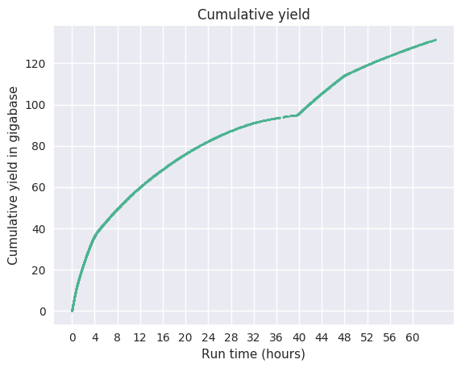
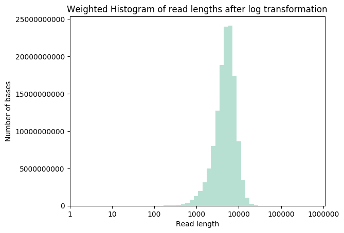

# Nanopore GridION and PromethION Mock Microbial Community Data

## Description of data

### Zymo Community Standards 2 (Even)

  - 10 species, all with equal genomic DNA input
  - Useful for evaluating nanopore assembly and taxonomic assignments
  - GRIDION
     - Bead-beating (~10Gb) (GRIDION-EVEN-BB)
     - Metapolyzyme (~10Gb) (GRIDION-EVEN-MPZ)
     - Hybrid BB + MPZ (~17Gb) (GRIDION-EVEN-MPZ-BB)

### Zymo Community Standards 2 (Log/Staggered)
 
   - 10 species from 10^2 - 10^7 genomic DNA abundance
   - Useful for evaluating limit of detection at high coverage
   - PromethION
      - Bead-beating (~130Gb) (PION-LOG-BB)

## Data availability

   - **GRIDION-EVEN-BB**
      - <a href="https://nanopore.s3.climb.ac.uk/GridION-Zymo_CS_LSK109.tar">Basecalls</a> (21.9Gb)
      - <a href="https://nanopore.s3.climb.ac.uk/GridION-Zymo_CS_LSK109_signal.tar">Basecalls+signal</a> (252.7Gb)
      - <a href="https://nanopore.s3.climb.ac.uk/GridION-Zymo_CS_BB_LSK109.fq.gz">Merged FASTQ</a> (3.2M reads, 9.5 GB, `e1e183c5bee9fedb0357d51d4dc4ed74`)
   - **GRIDION-EVEN-MPZ**
      - <a href="https://nanopore.s3.climb.ac.uk/GridION-Zymo_CS_MPZ_LSK109">Basecalls</a> (23.2Gb)
      - <a href="https://nanopore.s3.climb.ac.uk/GridION-Zymo_CS_MPZ_LSK109_signal.tar">Basecalls+signal</a> (283Gb)
      - <a href="https://nanopore.s3.climb.ac.uk/GridION-Zymo_CS_MPZ_LSK109.all.fq.gz">Merged FASTQ</a> (5.7M reads, 9.8 GB, `f18e3b3323b0ba15fdb783618ea18ea1`)
   - **GRIDION-EVEN-MPZ-BB**
      - <a href="https://nanopore.s3.climb.ac.uk/GridION-Zymo_CS_MPZBB_LSK109.tar">Basecalls</a> (35.8Gb)
      - <a href="https://nanopore.s3.climb.ac.uk/GridION-Zymo_CS_MPZBB_LSK109_signal.tar">Basecalls+signal</a> (396.9Gb)
      - <a href="https://nanopore.s3.climb.ac.uk/GridION-Zymo_CS_MPZBB_LSK109.all.fq.gz">Merged FASTQ</a> (5.8M reads, 16 GB, `88d159842bfc3b70ee1f1bf15c2aa7b9`)
   - **GRIDION-EVEN-BB+MPZ+MPZ-BB (ALL3)**
      - <a href="https://nanopore.s3.climb.ac.uk/GridION-Zymo_CS_ALL3_LSK109.all.fq.gz">Merged FASTQ</a> (14.73M reads, 35 GB, `e80c9ac91bf343352d6bcf57815dfc61`)
   - **PION-LOG-BB**
      - <a href="https://nanopore.s3.climb.ac.uk/PromethION-Zymo_CSII_LSK109.tar.gz">Basecalls</a> (128.2Gb)
      - Basecalls+signal (2.7Tb)

## Basic run stats

### PION-LOG-BB (PromethION)

```General summary:
Active channels:        2746
Mean read length:       3699.9
Mean read quality:      8.9
Median read length:     3342.0
Median read quality:    9.4
Number of reads:        35556299
Read length N50:        5071
Total bases:    131556241641
Number, percentage and megabases of reads above quality cutoffs
>Q5:    33095038 (93.1%) 13026.4Mb
>Q7:    29654587 (83.4%) 12130.3Mb
>Q10:   12428259 (35.0%) 5346.4Mb
>Q12:   43721 (0.1%) 13.3Mb
>Q15:   24 (0.0%) 0.0Mb
```





### GRIDION-EVEN-BB (Zymo\_CS\_LSK109)


### GRIDION-EVEN-MPZ (GridION-Zymo\_CS\_MPZ\_LSK109)

### GRIDION-EVEN-MPZ-BB (Zymo\_CS\_MPZBB\_LSK109)


## Initial assembly and consensus

```
minimap2 -t 24 -x ava-ont GridION-Zymo_CS_ALL3_LSK109.all.fq GridION-Zymo_CS_ALL3_LSK109.all.fq | gzip > GridION-Zymo_CS_ALL3_LSK109.all.fq.paf.gz
miniasm -f GridION-Zymo_CS_ALL3_LSK109.all.fq GridION-Zymo_CS_ALL3_LSK109.all.fq.paf.gz > GridION-Zymo_CS_ALL3_LSK109.all.miniasm.gfa
awk '/^S/{print ">"$2"\n"$3}' GridION-Zymo_CS_ALL3_LSK109.all.miniasm.gfa > GridION-Zymo_CS_ALL3_LSK109.all.miniasm.fa
minimap2 -t 12 -x map-ont GridION-Zymo_CS_ALL3_LSK109.all.miniasm.fa GridION-Zymo_CS_ALL3_LSK109.all.fq > GridION-Zymo_CS_ALL3_LSK109.all.reads_miniasm.paf
racon -t 36 GridION-Zymo_CS_ALL3_LSK109.all.fq GridION-Zymo_CS_ALL3_LSK109.all.reads_miniasm.paf GridION-Zymo_CS_ALL3_LSK109.all.miniasm.fa > GridION-Zymo_CS_ALL3_LSK109.all.miniasm.racon_r1.fa
minimap2 -t 12 -x map-ont GridION-Zymo_CS_ALL3_LSK109.all.miniasm.racon_r1.fa GridION-Zymo_CS_ALL3_LSK109.all.fq > GridION-Zymo_CS_ALL3_LSK109.all.reads_racon1.paf
racon -t 36 GridION-Zymo_CS_ALL3_LSK109.all.fq GridION-Zymo_CS_ALL3_LSK109.all.reads_racon1.paf GridION-Zymo_CS_ALL3_LSK109.all.miniasm.racon_r1.fa > GridION-Zymo_CS_ALL3_LSK109.all.miniasm.racon_r2.fa
```

* <a href="https://nanopore.s3.climb.ac.uk/GridION-Zymo_CS_ALL3_LSK109.all.miniasm.gfa">Miniasm Assembly (GFA)</a> (62 MB, `8104cd4621b0f6b0153a3309abc4c140`), <a href="https://nanopore.s3.climb.ac.uk/GridION-Zymo_CS_ALL3_LSK109.all.miniasm.fa">Miniasm Assembly (FASTA)</a> (61 MB, `94c183b396beb21090e324c2ff32baee`) 
* <a href="https://nanopore.s3.climb.ac.uk/GridION-Zymo_CS_ALL3_LSK109.all.miniasm.racon_r1.fa">Miniasm Assembly + Racon Round 1 (FASTA)</a> (61 MB, `761e8b4cf94a68aa9dd91af9ecc671c2`)
* <a href="https://nanopore.s3.climb.ac.uk/GridION-Zymo_CS_ALL3_LSK109.all.miniasm.racon_r2.fa">Miniasm Assembly + Racon Round 2 (FASTA)</a> (61 MB, `02dd8ab095849ddcd9000a93a80d6754`)

### `kraken2` taxonomic assignment

* <a href="https://refdb.s3.climb.ac.uk/kraken2-microbial/hash.k2d">hash.k2d</a> (30 GB, `b327a46e5f8122c6ce627aecf13ae5b1`)
* <a href="https://refdb.s3.climb.ac.uk/kraken2-microbial/opts.k2d">opts.k2d</a> (48 B,`e77f42c833b99bf91a8315a3c19f83f7`)
* <a href="https://refdb.s3.climb.ac.uk/kraken2-microbial/taxo.k2d">taxo.k2d</a> (1.7 MB, `764fee20387217bd8f28ec9bf955c484`)

```
mkdir kraken2-microbial-fatfree/
cd kraken2-microbial-fatfree/
wget https://refdb.s3.climb.ac.uk/kraken2-microbial/hash.k2d
wget https://refdb.s3.climb.ac.uk/kraken2-microbial/opts.k2d
wget https://refdb.s3.climb.ac.uk/kraken2-microbial/taxo.k2d

awk '/^S/{print ">"$2"\n"$3}' GridION-Zymo_CS_ALL3_LSK109.all.gfa > 12 GridION-Zymo_CS_ALL3_LSK109.all.gfa.fa
kraken2 --db kraken2-microbial-fatfree/ --threads 12 GridION-Zymo_CS_ALL3_LSK109.all.gfa.fa > GridION-Zymo_CS_ALL3_LSK109.all.gfa.fa.krak2
```

### `bracken` abundance assessment
Additionally, we've processed the database with `bracken` (assuming a read length distributed around 2500 bp).

* <a href="https://refdb.s3.climb.ac.uk/kraken2-microbial/database.kraken">database.kraken</a> (12 GB, `83cde830fbcc397ea9de5b69914aab1f`)
* <a href="https://refdb.s3.climb.ac.uk/kraken2-microbial/database2500mers.kraken">database2500mers.kraken</a> (3.5 MB, `f6faff82620f2c8fd4218dbdcc4237bd`)
* <a href="https://refdb.s3.climb.ac.uk/kraken2-microbial/database2500mers.kmer_distrib">database2500mers.kmer_distrib</a> (666 KB, `2a3d08d7c40b59882e149c33dc8e7b8b`)

```
cd kraken2-microbial-fatfree/
wget https://refdb.s3.climb.ac.uk/kraken2-microbial/database.kraken
wget https://refdb.s3.climb.ac.uk/kraken2-microbial/database2500mers.kraken
wget https://refdb.s3.climb.ac.uk/kraken2-microbial/database2500mers.kmer_distrib
```
