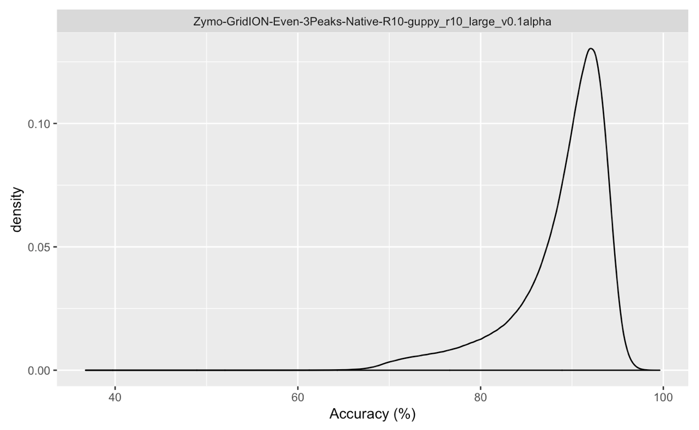
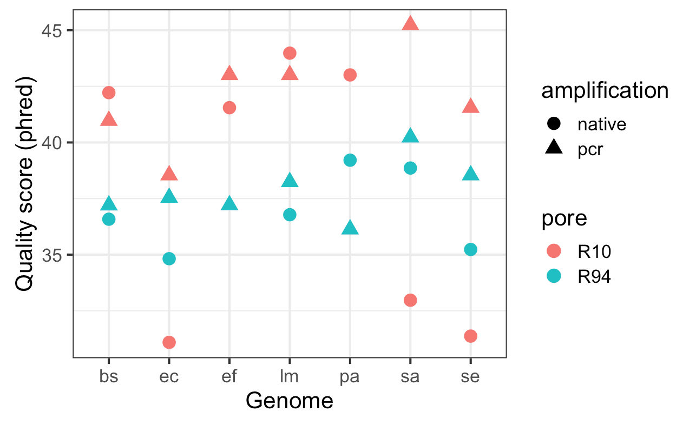

## R10.3 and 'R10m' Data Release (2020-02-07)

### New R10.3 Pore

Summary stats:
  * **Platform** ONT GridION
  * **Flowcells** 2
  * **Reads** 1.16 M
  * **Bases** 4.64 Gbp
  * **Read Length N50** 25,163 bp
  * **Mean Quality** 11.5
  
Download links:
- [Merged FASTQ Basecalls](https://nanopore.s3.climb.ac.uk/mock/Zymo-GridION-EVEN-3Peaks-R103-merged.fq.gz) (4.8 GB, `78497b92a6b8fde2e0f5d2291c707949`).

### Prototype R10 pore with methylation-aware basecalling model

Prototype R10 pore data basecalled with Guppy 3.2.4+d9ed22f and model `template_r10_450bps_hac_meth`.

Summary stats:
  * **Platform** ONT GridION
  * **Flowcells** 2
  * **Reads** 6.74 M
  * **Bases** 30.6 Gbp
  * **Read Length N50** 8,871 bp
  * **Mean Quality** 9.5

Download links:
- [Merged FASTQ Basecalls](https://nanopore.s3.climb.ac.uk/mock/Zymo-GridION-Even-3Peaks-Native-R10_hac_meth.fq.gz) (32 GB, `eed7625452dc5a9b6f6313c9e7200fa2`).

## R10 Native "3 Peaks" Data Release (2019-05-24)



Summary stats:
  * **Reads** 6.74 M
  * **Bases** 30.9 Gbp
  * **Read Length N50** 8893 bp
  * **Mean Quality** 9.6

Singal files were basecalled with Guppy 2.3.8 and the basecalling model `guppy_r10_large_v0.1alpha`.

Download links:
- [FAST5 Signal](https://nanopore.s3.climb.ac.uk/Zymo-GridION-Even-3Peaks-Native-R10.tar.gz) (375 GB)
- [FASTQ Basecalls](https://nanopore.s3.climb.ac.uk/Zymo-GridION-Even-3Peaks-Native-R10-guppy_r10_large_v0.1alpha.fq.gz) (33 GB, `f2a9c2a64f6104462a36622b53d8d424`)

Please note this is a preliminary analysis of R10 data with alpha release models and a pre-release pore
type and is subject to change!

## R10 PCR Data Release (2019-02-28)


Summary stats:

  * **Reads** 4.24 M
  * **Bases** 16.6 Gbp
  * **Read length N50** 4620 bp
  * **Median Quality** 8.0

Signal files were basecalled using Guppy 2.3.1+1b9405b using a pre-release basecalling model ```R10_flipflop_model.json```.

Download links (courtesy of <a href="http://www.climb.ac.uk">CLIMB</a>):

  - <a href="https://s3.climb.ac.uk/nanopore/Zymo-GridION-EVEN-BB-SN-PCR-R10HC-flipflop.fq.gz">FASTQ (12Gb)</a>
  - <a href="https://s3.climb.ac.uk/nanopore/Zymo-GridION-EVEN-BB-SN-PCR-R10HC_multi.tar">FAST5 (231Gb)</a>
  
Please note this is a preliminary analysis of R10 data with alpha release models and a pre-release pore
type and is subject to change!

## R9.4 ~ R10 Comparison



Reads from the Zymo mock community runs were binned by taxa using the Illumina draft assembly from our paper. Bins were downsampled to 200x and an assembly for each genome was built with `wtdbg2` (v2.4) with the `-x ont` parameter.

After `wtdbg2-poa` consensus, assemblies were polished with four rounds of `racon` and one round of `medaka` (R10 `-m medaka_r10_v0.1alpha.hdf`, R9.4 `-m r941_flip213`).

Per-genome accuracy was measured with [Jared Simpson's FASTMER script](https://github.com/jts/assembly_accuracy).

### Acknowledgements

We thank Rosemary Dokos, Chris Wright, Jon Pugh and Jayne Wallace from Oxford Nanopore Technologies for their help and assistance with preparation of these datasets.
